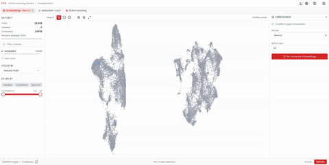
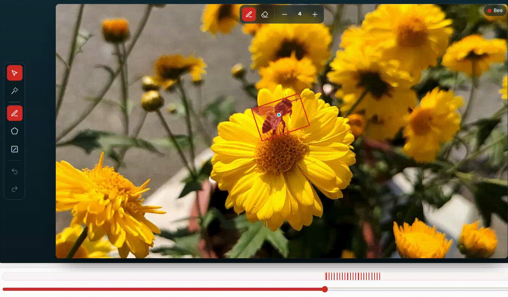
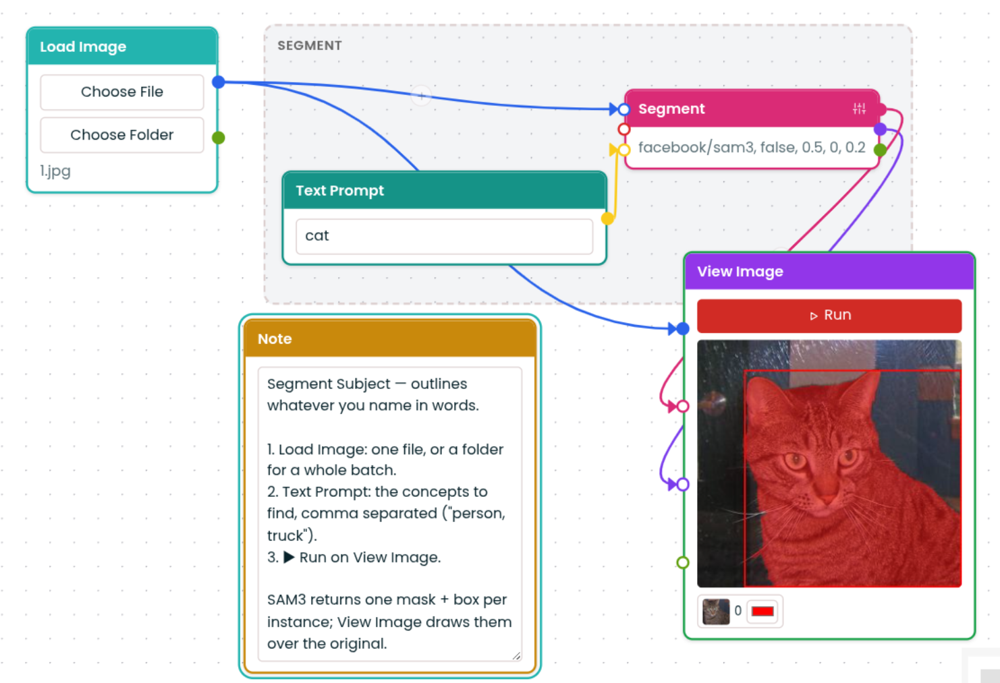

<div align="center">
  
  <h1>KumoVision</h1>
  <p><b>Open-source computer vision that stays in Europe.</b><br>
  Label your data, host your models, run the inference. Self-hosted, GDPR-compliant, Apache 2.0.</p>
  <p>
    <a href="https://github.com/iits-consulting/kumo-label">KumoLabel</a> ·
    <a href="https://github.com/iits-consulting/kumo-track">KumoTrack</a> ·
    <a href="https://github.com/iits-consulting/kumo-flow">KumoFlow</a> ·
    <a href="https://huggingface.co/Iits-consulting">Hugging Face</a>
  </p>
</div>

KumoVision is a set of open-source tools that covers the whole computer vision pipeline, from the first labeled image to a model running as a service. Each tool lives in its own repository and runs on its own, so you can pick the one you need. Everything you build with it stays yours: the tools build on the Hugging Face Hub, with [MONAI](https://project-monai.github.io/) for medical imaging, so you can take your models and run them without us.

## The tools

### 🏷️ [KumoLabel](https://github.com/iits-consulting/kumo-label): label thousands of images at once

KumoLabel sorts your images by what's actually in them, so you label a whole cluster in one go instead of clicking through them one by one.



```bash
git clone https://github.com/iits-consulting/kumo-label && cd kumo-label
mkdir -p data && docker compose up --build   # http://localhost:8000
```

### 🎯 [KumoTrack](https://github.com/iits-consulting/kumo-track): annotate one frame instead of many

Mark an object once, and KumoTrack follows it through the rest of the video. You only step back in where it loses track.



```bash
git clone https://github.com/iits-consulting/kumo-track && cd kumo-track
HF_TOKEN=hf_... docker compose up   # http://localhost:8080
```

### 🔗 [KumoFlow](https://github.com/iits-consulting/kumo-flow): connect models into a pipeline, without code

Connect your models on screen and run them as one pipeline, with whatever you built in the other Kumo tools and with models from the Hub. Deploy it, and it runs as a service the rest of your software can use.



```bash
git clone https://github.com/iits-consulting/kumo-flow && cd kumo-flow
make up   # http://localhost:5173
```

Each repository's README has the full setup, configuration and GPU options.

## Need a hand?

Want us to deploy KumoVision, integrate your models or set up the cameras and hardware? Write to [projekte@iits-consulting.de](mailto:projekte@iits-consulting.de).

KumoVision is built by [iits-consulting](https://iits-consulting.de/en/about-us). All tools are licensed under [Apache 2.0](LICENSE).
